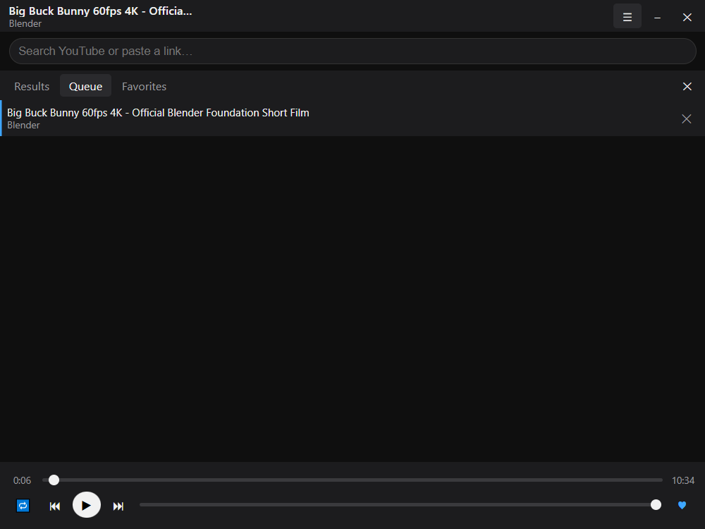

# YouTube Music Mini-Player

Frameless, always-on-top floating YouTube mini-player for Windows (AHA Music style).
Plain Electron + vanilla JS — no bundler, no framework, no API key.



## Features

- 340x420 frameless dark window, always on top, draggable titlebar
- Search YouTube by keyword (keyless, via `youtube-sr`) or paste any YouTube link
- Play queue: add (`+`), remove, prev/next, auto-advance on track end
- Repeat modes: off / one / all
- Favorites with one-click toggle (♥)
- Seek bar, current/total time, volume slider
- Everything persists across launches (queue, position, favorites, volume, repeat)
- Embed-blocked videos: clear fallback + "Open on YouTube" + capped auto-skip

## Quick start

```powershell
npm install
npm start
```

Dev mode (CDP debugging on port 9222):

```powershell
npm run dev
```

## How it works

- **Main process (ESM):** [main.js](main.js) boots a loopback static server
  ([main/local-server.js](main/local-server.js)) — YouTube rejects embeds from
  `file://` origins (player errors 152/153), so the shell is served over
  `http://127.0.0.1:<random port>`. Search runs in main via
  [main/youtube-search.js](main/youtube-search.js); persistence via
  `electron-store` in [main/store-manager.js](main/store-manager.js).
- **Preload:** [preload.cjs](preload.cjs) exposes an allowlisted `window.api`
  bridge (contextIsolation + sandbox enabled).
- **Renderer (vanilla JS):** [renderer/app.js](renderer/app.js) bootstraps;
  [renderer/player-controller.js](renderer/player-controller.js) wraps the
  YouTube IFrame Player API; queue/search/favorites/error modules are isolated.

## Verification

```powershell
npm run check                      # syntax-check every JS file
npm run dev                        # then, in another terminal:
node scripts/verify-app.cjs        # IPC + store + search + player smoke test
node scripts/e2e-playback-test.cjs # real playback e2e over CDP
```

Manual checklist: [docs/manual-test-checklist.md](docs/manual-test-checklist.md)
Packaging (optional): [docs/packaging-note.md](docs/packaging-note.md)
