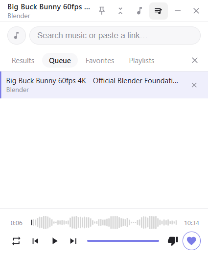

# FloatWave

FloatWave is a lightweight, unofficial floating mini-player for YouTube and
YouTube Music on Windows. It is built with plain Electron and vanilla
JavaScript, with no framework, no bundler, and no API key.

This project is optimized for a small always-on-top player, global media
controls, queue management, favorites, and low memory use compared with running
a full YouTube Music web app window.




## Status

FloatWave is a free, open-source, unofficial companion app. It is not affiliated
with, endorsed by, or sponsored by YouTube, Google, or YouTube Music.

Typical memory usage on the author's Windows test machine is around
200-300 MB. Actual usage depends on Electron, Chromium, YouTube pages, playback
mode, extensions, GPU state, and the current queue.

## Features

- 340x420 frameless floating window with draggable titlebar.
- Optional pin-on-top state, persisted across launches.
- Minimize-to-tray support. The minimize button hides the window; the close
  button quits the app.
- Focus mode: compact 340x116 titlebar-and-controls view, persisted.
- Music / Video search mode. Music mode targets YouTube Music song results;
  Video mode targets normal YouTube video results. Pasted YouTube links are also
  supported.
- Web mode: opens music.youtube.com in a separate floating window so users can
  sign in and use personal playlists or recommendations.
- Queue, favorites, user playlists, repeat modes, drag-and-drop ordering, and
  search history.
- Global hotkeys: media keys and Ctrl+Alt+Space / Ctrl+Alt+Right /
  Ctrl+Alt+Left.
- Smart suggestions based on listening behavior, favorites, skips, and dislikes.
- Waveform-style seek bar, seek, time display, and volume control.
- Embed-fallback path for tracks that cannot play inside the YouTube iframe.
- Network filtering and in-player ad handling are included as user-side
  convenience features, but they are not the main project positioning.

## Privacy

FloatWave does not run a custom backend and does not collect analytics.
Playback, search, sign-in, and recommendations are provided by YouTube,
YouTube Music, and the local Electron app runtime.

Local app preferences are stored on the user's machine through `electron-store`.
The YouTube Music web mode uses a persistent Electron session so Google sign-in
can survive restarts.

More detail: [PRIVACY.md](PRIVACY.md)

## Quick Start

```powershell
npm install
npm start
```

Dev mode with Chrome DevTools Protocol on port 9222:

```powershell
npm run dev
```

## Build A Windows Installer

```powershell
npm install
npm run release:win
```

Artifacts are written to `dist/`. The release script also writes
`dist/checksums.sha256` for GitHub Releases.

The installer is not code signed by default. Windows SmartScreen may warn users
until the project has a trusted signing certificate and publisher reputation.

## How It Works

- Main process: [main.js](main.js) boots a loopback static server through
  [main/local-server.js](main/local-server.js). YouTube embeds are served from a
  local HTTP origin because `file://` embeds can be rejected by the player.
  Search runs in [main/youtube-search.js](main/youtube-search.js); persistence
  lives in [main/store-manager.js](main/store-manager.js).
- Preload: [preload.cjs](preload.cjs) exposes an allowlisted `window.api`
  bridge with context isolation and sandboxing enabled.
- Renderer: [renderer/app.js](renderer/app.js) bootstraps the vanilla JS app.
  Playback, queue, search, favorites, playlists, and error handling are split
  across focused renderer modules.

## Verification

```powershell
npm run check
npm audit --omit=dev

# Optional live tests. Start dev mode in one terminal:
npm run dev

# Then run smoke or e2e checks in another terminal:
node scripts/verify-app.cjs
node scripts/e2e-playback-test.cjs
node scripts/e2e-feature-suite.cjs run

# Restart the app, then verify session restore:
node scripts/e2e-feature-suite.cjs verify-restore
```

Manual checklist: [docs/manual-test-checklist.md](docs/manual-test-checklist.md)  
Packaging notes: [docs/packaging-note.md](docs/packaging-note.md)  
Release checklist: [docs/release-checklist.md](docs/release-checklist.md)

## License

MIT. See [LICENSE](LICENSE).
